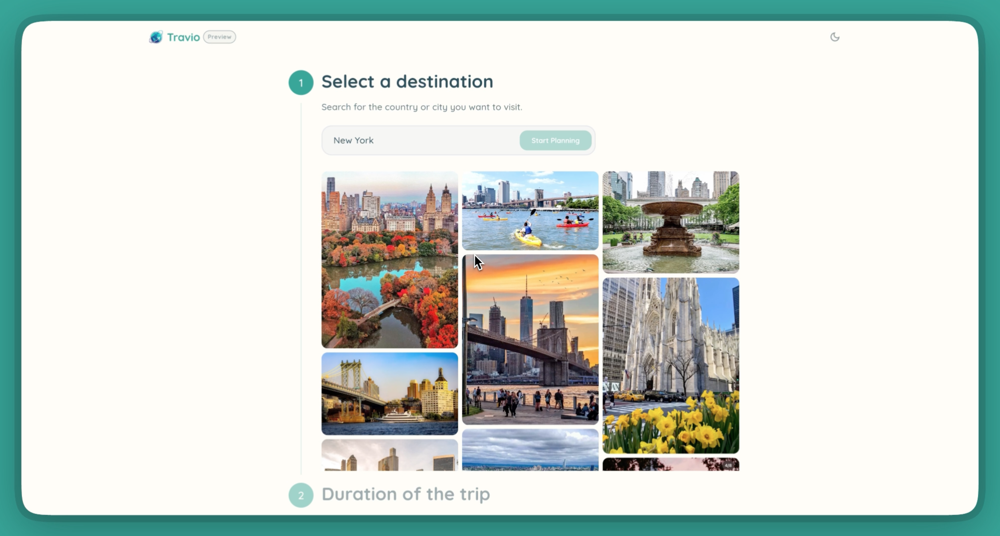

# 🌍 Travio - AI-Powered Travel Planning Platform

**Craft unforgettable adventures with Travio, the intuitive web app designed to simplify your trip planning from dream to destination.**


[](./demo/Travio%20Studio.mp4)
[](https://hackathon.appwrite.network/)
[](./LICENSE)

> **Try out here: [travio.appwrite.network](https://travio.appwrite.network/).**
>
> 📹 **[Demo Video](https://drive.google.com/file/d/1UjXDBXIsA1wH0QDNpDwV4avBGv5zu4kQ/view?usp=sharing)** - Complete walkthrough of Travio's features

## 📖 About

Travio is a comprehensive travel planning platform that combines the power of AI, Google Services, and Firebase to create seamless trip planning experiences. Built for the [Appwrite Sites Hackathon 2025](https://hackathon.appwrite.network/), this application demonstrates modern web development practices with Flutter Web.

### ✨ Key Features

- 🤖 **AI-Powered Document Processing** - Automatically extracts flight and hotel information using Google Gemini Vision API
- 🗺️ **Interactive Trip Planning** - Google Maps integration with place markers and smooth animations
- 📱 **Responsive Design** - Beautiful, modern UI that works across all devices (still WIP)
- 🔐 **Smart Authentication** - Users can get started with a trip without signing up, and convert to authenticated accounts later
- 📊 **Real-Time Data Sync** - Live updates using Firestore streams
- 🎯 **Intelligent Caching** - Optimized API usage with smart caching strategies





## 🛠️ Tech Stack

### **Frontend Framework**
- **Flutter Web** `^3.35.3` - Cross-platform UI framework
- **Dart** - Programming language

### **Backend & Database**
- **Firebase Core** `^4.0.0` - Backend-as-a-Service platform
- **Cloud Firestore** `^6.0.0` - NoSQL document database
- **Firebase Authentication** `^6.0.1` - User authentication
- **Firebase Storage** `^13.0.1` - File storage
- **Firebase Functions** `^6.0.0` - Serverless backend logic
- **Node.js** `22` - Cloud Functions runtime

### **AI Integration**
- **Google Gemini Vision AI** - Document classification and data extraction

### **Maps & Location**
- **Google Maps Flutter** `^2.13.1` - Interactive maps
- **Google Places API (New)** - Location search and details
- **Place Photo Caching** - Optimized image loading

## 🏗️ Architecture

### **Frontend Architecture**
```
lib/
├── models/          # Data models (Trip, Place, Document, User)
├── services/        # Business logic and API integrations
├── widgets/         # Reusable UI components
├── screens/         # Page-level components
├── providers/       # State management
├── router/          # Navigation configuration
└── utils/           # Helper functions and constants
```

### **Backend Architecture**
```
functions/
├── index.js         # Cloud Functions (Places API, AI processing)
├── package.json     # Node.js dependencies
└── .env            # Environment variables (gitignored)
```

### **Database Schema**
```
Firestore Collections:
├── users/           # User profiles and authentication data
├── trips/           # Trip documents with nested subcollections
│   ├── visit_places/    # Selected places to visit
│   ├── documents/       # Uploaded travel documents
│   │   ├── flight_info/     # Extracted flight information
│   │   │   ├── origin_place/    # Airport details
│   │   │   └── destination_place/ # Airport details
│   │   └── accommodation_info/  # Extracted hotel information
└── place_cache/     # Cached Google Places API responses
```

## 🚀 Features Deep Dive

### **1. AI-Powered Document Processing**
- Upload flight tickets, hotel bookings, and travel documents
- Automatic classification using Google Gemini Vision AI
- Structured data extraction (flight numbers, dates, hotel details)
- Real-time processing with Firestore triggers

### **2. Interactive Trip Planning**
- Multi-step planning wizard with smooth scrolling
- Place search with Google Places API integration
- Date selection with calendar picker
- Popular places selection with caching

### **3. Advanced Map Integration**
- Google Maps with custom styling (light/dark themes)
- Place markers with opacity-based focus system
- Smooth camera animations on place selection
- Manual gesture detection for selection reset

### **4. Smart Authentication System**
- Anonymous user support for immediate trip creation
- Email/password and Google Sign-In options
- Seamless anonymous-to-authenticated user conversion
- Trip ownership transfer and privacy controls

### **5. Performance Optimizations**
- **Place Photo Caching**: Firestore-based cache to reduce API costs
- **Popular Places Caching**: Smart caching of frequently requested data
- **Batch Firestore Operations**: Efficient database queries
- **Debounced API Calls**: Optimized user input handling

## 🔐 Security & Privacy

- **API Key Security**: All sensitive keys stored in Cloud Functions
- **Environment Variables**: Secure configuration management
- **User Privacy**: Public/private trip visibility controls
- **Data Validation**: Client and server-side input validation

## 📦 Installation & Setup

### **Prerequisites**
- Flutter SDK `^3.35.3`
- Node.js `22+` (for Cloud Functions)
- Firebase CLI
- Google Cloud Platform account

### **Local Development**
```bash
# Clone the repository
git clone <repository-url>
cd travio

# Install Flutter dependencies
flutter pub get

# Set up Firebase (follow functions/README.md)
cd functions
npm install
# Configure .env file with API keys
cd ..

# Run the app
flutter run -d web
```

### **Environment Variables**
Required environment variables for Cloud Functions:
- `GOOGLE_PLACES_API_KEY` - Google Places API (New) key
- `GEMINI_API_KEY` - Google Gemini AI API key

## 📄 License

This project is licensed under the MIT License - see the [LICENSE](./LICENSE) file for details.

```
MIT License

Copyright (c) 2025 Souvik Biswas

Permission is hereby granted, free of charge, to any person obtaining a copy
of this software and associated documentation files (the "Software"), to deal
in the Software without restriction, including without limitation the rights
to use, copy, modify, merge, publish, distribute, sublicense, and/or sell
copies of the Software, and to permit persons to whom the Software is
furnished to do so, subject to the following conditions:

The above copyright notice and this permission notice shall be included in all
copies or substantial portions of the Software.

THE SOFTWARE IS PROVIDED "AS IS", WITHOUT WARRANTY OF ANY KIND, EXPRESS OR
IMPLIED, INCLUDING BUT NOT LIMITED TO THE WARRANTIES OF MERCHANTABILITY,
FITNESS FOR A PARTICULAR PURPOSE AND NONINFRINGEMENT. IN NO EVENT SHALL THE
AUTHORS OR COPYRIGHT HOLDERS BE LIABLE FOR ANY CLAIM, DAMAGES OR OTHER
LIABILITY, WHETHER IN AN ACTION OF CONTRACT, TORT OR OTHERWISE, ARISING FROM,
OUT OF OR IN CONNECTION WITH THE SOFTWARE OR THE USE OR OTHER DEALINGS IN THE
SOFTWARE.
```

---

**Built with ❤️ for the Appwrite Sites Hackathon 2025**
